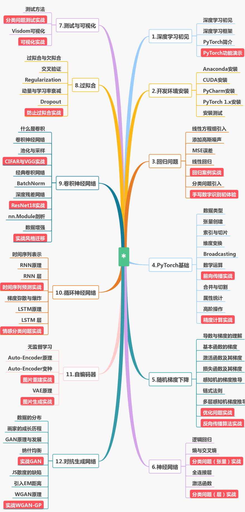

# PyTorch安装指令
请先安装Anaconda和CUDA 10.0。

- 配置国内源

```python
# 配置国内源，方便安装Numpy,Matplotlib等
conda config --add channels https://mirrors.tuna.tsinghua.edu.cn/anaconda/pkgs/free/
conda config --add channels https://mirrors.tuna.tsinghua.edu.cn/anaconda/pkgs/main/
# 配置国内源，安装PyTorch用
conda config --add channels https://mirrors.tuna.tsinghua.edu.cn/anaconda/cloud/pytorch/
# 显示源地址
conda config --set show_channel_urls yes
```

- 安装PyTorch
```python
# 安装PyTorch，要使用国内源请去掉-c pytorch这个参数！！
conda install pytorch torchvision cudatoolkit=10.0

```

- 安装常用库

```python
pip install numpy matplotlib pillow pandas
```

# 课程链接

<!--  
<p align="center">
  <a href="https://study.163.com/course/courseMain.htm?share=2&shareId=480000001847407&courseId=1208894818&_trace_c_p_k2_=61a9e0a511f7409b92a08d4f4c964330
">
    
  </a>
</p> 
 -->
**课程链接:** https://study.163.com/course/courseMain.htm?share=2&shareId=480000001847407&courseId=1208894818&_trace_c_p_k2_=61a9e0a511f7409b92a08d4f4c964330

<p align="center">
  
</p> 

 
**课程大纲:**



