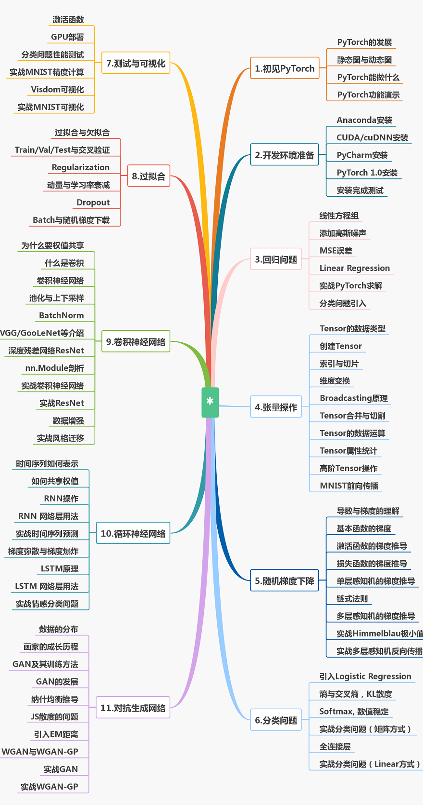

# 深度学习与PyTorch入门实战视频教程

课程涵盖了人工智能的发展历程，基本的数学理论，线性回归，逻辑回归，梯度及梯度下降，损失函数，激活函数，多分类问题，BatchNorm，卷积神经网络CNN/ResNet，循环神经网络RNN/LSTM，对抗生成网络GAN/WGAN，自编码器等等，以及详细的算法实战指导。
学完本课程，学员对当前深度学习的核心内容有全面深刻的掌握，同时也能利用PyTorch实现复杂的神经网络算法。

详情请前往：https://study.163.com/provider/480000001847407/index.htm?share=2&shareId=480000001847407

课程开发环境：
- Python 3.6 with Anaconda
- CUDA 10.0
- PyTorch 1.0
- Windows 10

添加：
1. CIFAR10与ResNet18实战
2. AE和Variational AE实战

